# GoRecon

> Ten ProjectDiscovery engines. One binary. Zero friction.

```
╔══════════════════════════════════════════════════════════════╗
║                                                              ║
║   ██████╗  ██████╗ ██████╗ ███████╗ ██████╗ ██████╗ ███╗   ██╗
║  ██╔════╝ ██╔═══██╗██╔══██╗██╔════╝██╔════╝██╔═══██╗████╗  ██║
║  ██║  ███╗██║   ██║██████╔╝█████╗  ██║     ██║   ██║██╔██╗ ██║
║  ██║   ██║██║   ██║██╔══██╗██╔══╝  ██║     ██║   ██║██║╚██╗██║
║  ╚██████╔╝╚██████╔╝██║  ██║███████╗╚██████╗╚██████╔╝██║ ╚████║
║   ╚═════╝  ╚═════╝ ╚═╝  ╚═╝╚══════╝ ╚═════╝ ╚═════╝ ╚═╝  ╚═══╝
║                                                              ║
║              Unified Reconnaissance Toolkit                  ║
╚══════════════════════════════════════════════════════════════╝
```

---

## Engines

| Command | Purpose |
|----------|---------|
| `subdomain` | Passive subdomain enumeration |
| `dns` | DNS resolution & bruteforce |
| `scan` | Port scanning (SYN/CONNECT) |
| `http` | HTTP probing & technology detection |
| `crawl` | Web crawling & endpoint discovery |
| `vuln` | Template-based vulnerability scanning |
| `tls` | TLS/SSL certificate analysis |
| `cdn` | CDN / Cloud / WAF detection |
| `takeover` | Subdomain takeover detection (30+ services) |
| `uncover` | External asset discovery (19 search engines) |

> **Aliases:** `sub`, `dnsx`, `portscan`/`naabu`, `httpx`, `katana`, `nuclei`, `tlsx`/`ssl`, `cdncheck`, `take`, `pipeline`, `search`, `list`

---

## Architecture

### Reconnaissance Phases

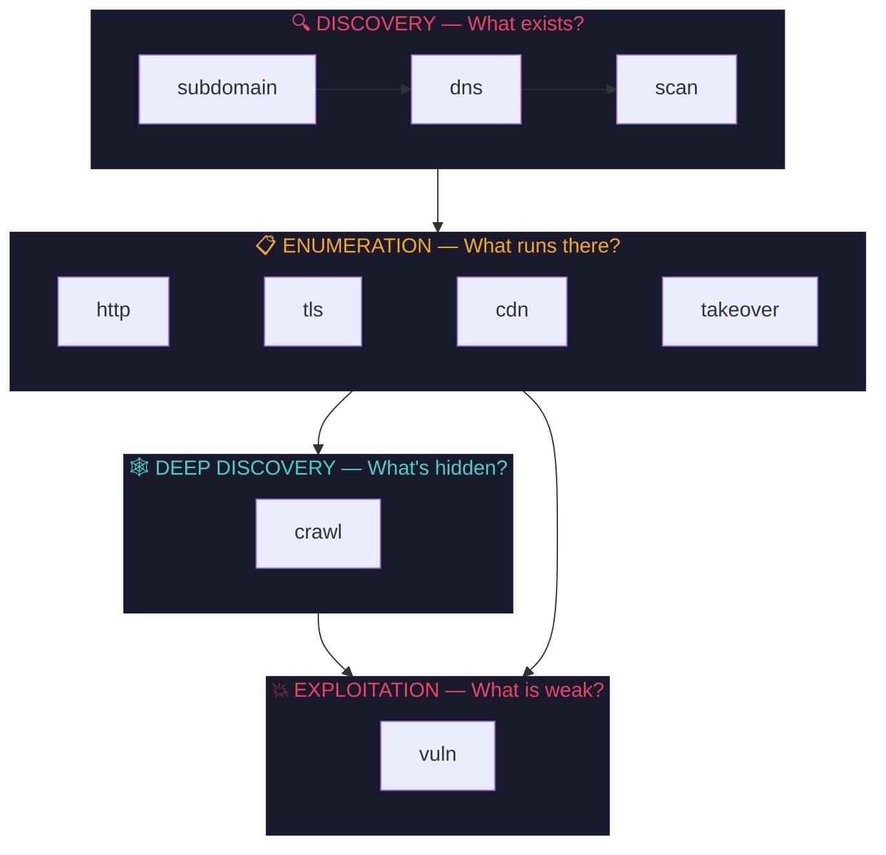

### Engine Input/Output Map

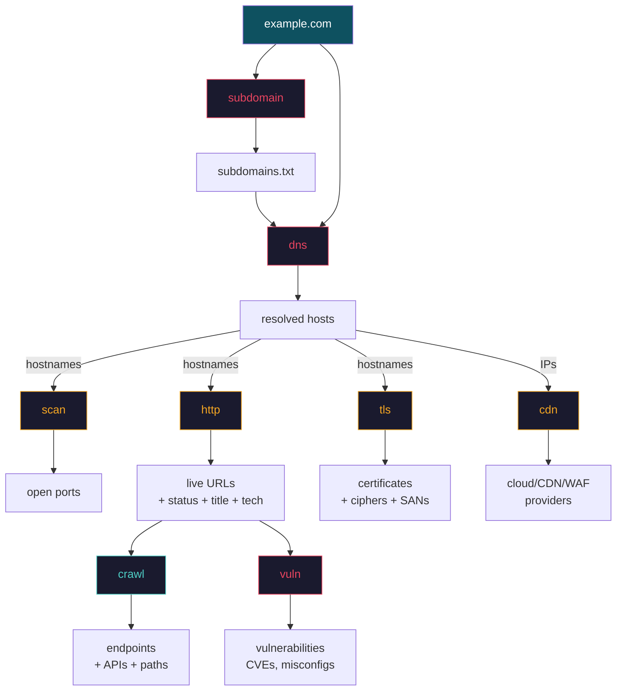

---

## Pipeline: `gorecon recon`

### Execution Order (Mermaid Flowchart)

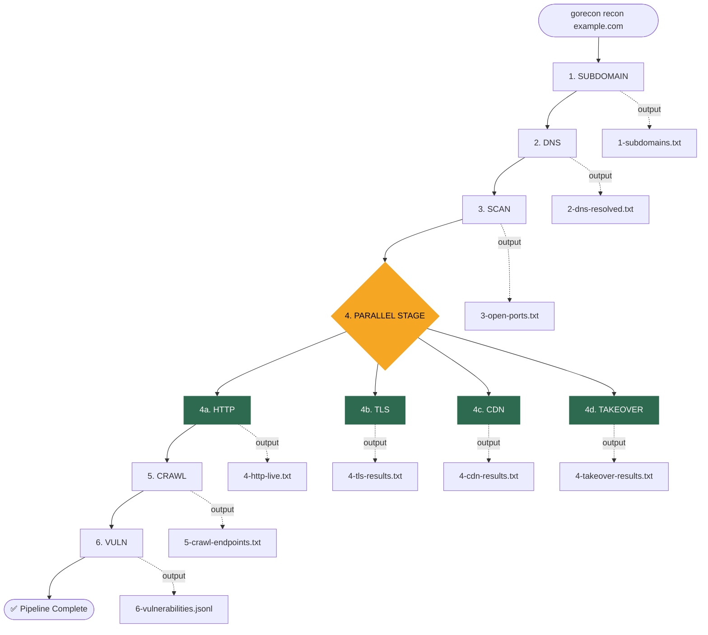

### Why This Order (Sequence Diagram)

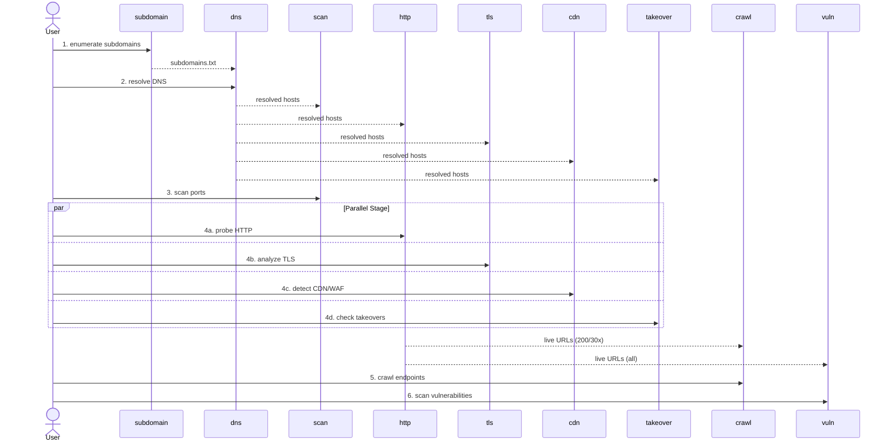

### Usage

```bash
# Full pipeline — every stage runs
gorecon recon example.com

# Custom ports and severity
gorecon recon example.com -p 80,443,8080,8443 -s critical,high

# Output to named directory
gorecon recon example.com -o results/

# Lightweight — skip heavy stages
gorecon recon example.com --no-scan --no-crawl --no-vuln

# Discovery only — just find what exists
gorecon recon example.com --no-tls --no-cdn --no-crawl --no-vuln
```

### Pipeline Flags

| Flag | Default | Description |
|------|---------|-------------|
| `-d`, `--domain` | *(required)* | Target domain |
| `-l`, `--list` | — | File with list of domains |
| `-o`, `--output` | `gorecon-output-<ts>/` | Output directory |
| `-w`, `--wordlist` | — | Wordlist for DNS bruteforce |
| `-p`, `--ports` | `80,443,8080,8443,...` | Ports to scan |
| `-s`, `--severity` | `critical,high,medium` | Nuclei severity filter |
| `-t`, `--templates` | — | Nuclei templates path |
| `--no-scan` | false | Skip port scanning |
| `--no-http` | false | Skip HTTP probing |
| `--no-tls` | false | Skip TLS analysis |
| `--no-cdn` | false | Skip CDN detection |
| `--no-takeover` | false | Skip takeover detection |
| `--no-crawl` | false | Skip web crawling |
| `--no-vuln` | false | Skip vulnerability scanning |

### Output Structure

```
gorecon-output-20260706-120000/
├── 1-subdomains.txt          ← list of subdomains (one per line)
├── 2-dns-resolved.txt        ← host [TYPE] [value]
├── 3-open-ports.txt          ← host:port pairs
├── 4-http-live.txt           ← https://host [status] [title] [tech1,tech2]
├── 4-tls-results.txt         ← host:port tls_version CN:name SAN:name1,name2
├── 4-cdn-results.txt         ← host [type] [provider]
├── 4-takeover-results.txt    ← subdomain CNAME service http_code verified
├── 5-crawl-endpoints.txt     ← discovered URLs and endpoints
└── 6-vulnerabilities.jsonl   ← vulnerability findings in JSONL format
```

---

## Command Reference

### Data Flow: Which Command Needs What

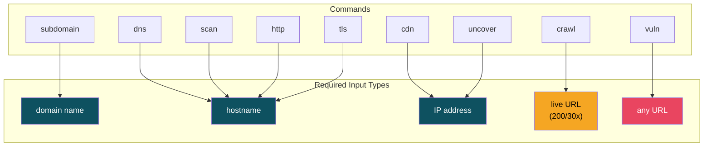

---

### 1. `subdomain` — Passive Enumeration

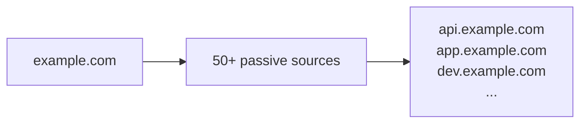

Discover subdomains via passive sources: crt.sh, AlienVault, Censys, Chaos, Shodan, etc.

```bash
gorecon subdomain example.com                        # basic
gorecon subdomain example.com -all                   # all sources (thorough)
gorecon subdomain example.com -all -silent -o out.txt # output to file
gorecon subdomain -dL domains.txt -o all.txt         # multiple domains
```

| Flag | Description |
|------|-------------|
| `-d`, `-domain` | Target domain(s) |
| `-dL`, `-list` | File containing list of domains |
| `-all` | Use all sources (slow but complete) |
| `-s`, `-sources` | Specific sources (comma-separated) |
| `-o`, `-output` | Output file |
| `-oJ`, `-json` | JSON output |
| `-silent` | Results only, no banner |

---

### 2. `dns` — Resolution & Bruteforce

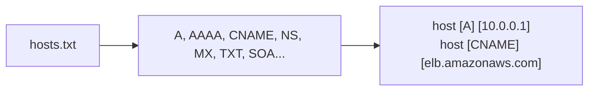

```bash
gorecon dns -l hosts.txt                        # resolve a list
gorecon dns -l hosts.txt -a -re                 # all records + full response
gorecon dns -d example.com -w words.txt -a      # bruteforce mode
gorecon dns -l hosts.txt -a -ro > ips.txt       # IPs only (for piping)
```

| Flag | Description |
|------|-------------|
| `-l`, `--list` | File with hosts/domains |
| `-d`, `--domain` | Domain to bruteforce |
| `-w`, `--wordlist` | Wordlist for bruteforce |
| `-a`, `--all` | All record types |
| `-re`, `--resp` | Show full DNS response |
| `-ro`, `--resp-only` | IP addresses only |
| `-j`, `--json` | JSON output |
| `-o`, `--output` | Output file |
| `-t`, `--threads` | Concurrency (default: 100) |
| `-rl`, `--rate-limit` | Requests/second |

---

### 3. `scan` — Port Scanning

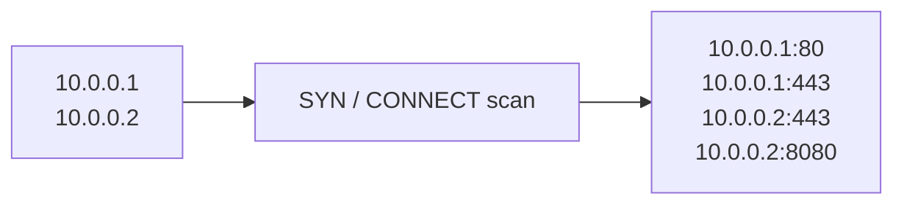

```bash
gorecon scan example.com -p 80,443              # specific ports
gorecon scan example.com -tp 1000               # top 1000 ports
gorecon scan example.com -tp 1000 -rate 5000    # high-speed scan
gorecon scan example.com -passive               # Shodan only (stealth)
gorecon scan -l hosts.txt -tp 100 -o ports.txt
```

| Flag | Description |
|------|-------------|
| `-host` | Target host(s) |
| `-l`, `-list` | File with hosts |
| `-p`, `-port` | Ports (`80,443` or `1-1000`) |
| `-tp`, `-top-ports` | `full`, `100`, `1000` |
| `-rate` | Packets/second (default: 1000) |
| `-passive` | Shodan InternetDB (no active scan) |
| `-o`, `-output` | Output file |

---

### 4. Parallel Stage — HTTP, TLS, CDN, Takeover

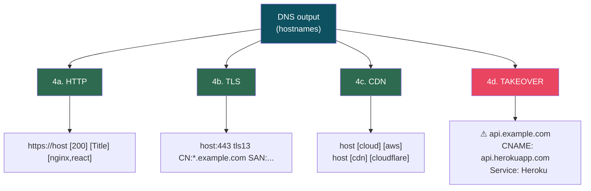

**HTTP:**
```bash
gorecon http -l hosts.txt                                    # basic
gorecon http -l hosts.txt -sc -title -td                     # status + title + tech
gorecon http -l hosts.txt -sc -title -td -server -ip -cdn    # full detail
gorecon http -l hosts.txt -sc -mc 200,302 -o live.txt        # filter 200/302
```

**TLS:**
```bash
gorecon tls example.com                                      # basic
gorecon tls example.com -san -cn -tv -cipher -jarm           # full cert
gorecon tls -l hosts.txt -ex -ss -mm -o weak-certs.txt       # filter weak
```

**CDN:**
```bash
gorecon cdn -i 1.1.1.1                                       # single IP
gorecon cdn -l ips.txt -resp                                  # show provider names
gorecon cdn -l hosts.txt -cdn -o cdn-only.txt                 # CDN only
```

**Takeover:**
```bash
gorecon takeover -d example.com                                # auto-discover + check
gorecon takeover -d example.com -all -w subs.txt               # all sources + bruteforce
gorecon takeover -l subs.txt -o results.txt                    # check existing list
gorecon takeover -d example.com --only heroku                  # filter by service
gorecon takeover -d example.com -v --no-http                   # dry-run (CNAME only)
gorecon takeover api.example.com                               # single subdomain
cat subs.txt | gorecon takeover -silent                        # pipe via stdin
```

---

### 4d. `takeover` — Subdomain Takeover Detection

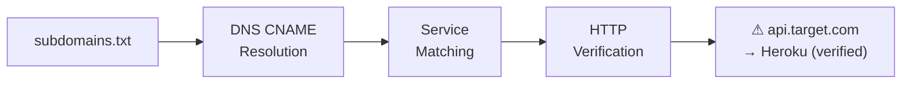

Detect dangling CNAME records pointing to unclaimed SaaS/cloud services. Pipeline: enumerate subdomains (optional) → resolve CNAMEs → match against 30+ service fingerprints → HTTP verify with signature matching.

```bash
gorecon takeover -d example.com                                # auto-discover + check
gorecon takeover -d example.com -all                           # all subdomain sources
gorecon takeover -d example.com -w wordlist.txt                # discover + bruteforce
gorecon takeover -l subs.txt                                   # check existing list
gorecon takeover -d example.com --only heroku                  # single service
gorecon takeover -d example.com --exclude cloudfront           # exclude false positives
gorecon takeover -d example.com -v --no-http                   # dry-run (CNAME only)
gorecon takeover -d example.com -j -o findings.jsonl           # JSON output
gorecon takeover api.example.com                               # single subdomain
cat subs.txt | gorecon takeover -silent                        # pipe via stdin
```

| Flag | Description |
|------|-------------|
| `-d`, `--domain` | Target domain (auto-discovers subdomains) |
| `-l`, `--list` | File with list of subdomains |
| `-w`, `--wordlist` | Wordlist for DNS bruteforce |
| `-o`, `--output` | Output file |
| `-t`, `--threads` | Concurrency (default: 50) |
| `-j`, `--json` | JSON output |
| `-v`, `--verbose` | Show all CNAME records found |
| `-all` | Use all passive sources |
| `--only` | Only check specific service (e.g. `github`, `heroku`) |
| `--exclude` | Exclude service (e.g. `cloudfront`) |
| `--no-discover` | Skip subdomain discovery |
| `--no-http` | Skip HTTP verification (CNAME matches only) |
| `-silent` | Results only |

**Supported Services (30+):**
AWS S3, CloudFront, GitHub Pages, Heroku, Surge.sh, Netlify, Firebase,
Cloudflare Pages, Azure WebApps, Shopify, Bitbucket, Readme.io, Freshdesk,
HelpScout, Cargo, Tilda, Statuspage, Intercom, Zendesk, Ghost, Pantheon,
Unbounce, LaunchRock, Acquia, GetResponse, Campaign Monitor, WordPress, MailChimp

---

### 5. `uncover` — External Asset Discovery

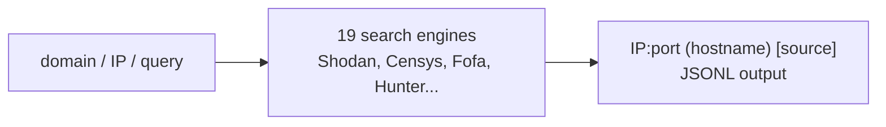

Query public search engines to discover exposed hosts, IPs, and services beyond passive DNS enumeration. Free tier via `shodan-idb` (no API key). Advanced use with raw search queries across Shodan, Censys, Fofa, Hunter, ZoomEye, and more.

```bash
gorecon uncover -d example.com                                # free: DNS + shodan-idb
gorecon uncover -d example.com -a shodan,censys               # multi-agent
gorecon uncover -d example.com -j -o results.jsonl            # JSON output
gorecon uncover -i 1.2.3.4                                    # single IP
gorecon uncover -q "ssl:example.com" -a shodan -l 500         # raw query
gorecon uncover -q "org:Google" -a shodan,censys,fofa         # multi-agent query
cat ips.txt | gorecon uncover -silent                         # pipe via stdin
```

| Flag | Description |
|------|-------------|
| `-d`, `--domain` | Target domain (auto-resolves DNS → queries shodan-idb) |
| `-i`, `--ip` | Target IP or CIDR |
| `-q`, `--query` | Raw search query (requires API key agent) |
| `-a`, `--agent` | Search engines (default: shodan-idb) |
| `-l`, `--limit` | Max results per agent (default: 100) |
| `-o`, `--output` | Output file |
| `-j`, `--json` | JSONL output |
| `-silent` | Results only |
| `-v`, `--verbose` | Show errors and warnings |

**Supported Agents (19):**
`shodan-idb` (free), `shodan`, `censys`, `fofa`, `quake`, `hunter`, `zoomeye`,
`netlas`, `criminalip`, `publicwww`, `hunterhow`, `google`, `odin`, `binaryedge`,
`onyphe`, `driftnet`, `greynoise`, `daydaymap`, `nerdydata`

> API keys stored in `~/.config/uncover/provider-config.yaml`. See `gorecon uncover -h` for provider config format.

---

### 6. `crawl` — Endpoint Discovery

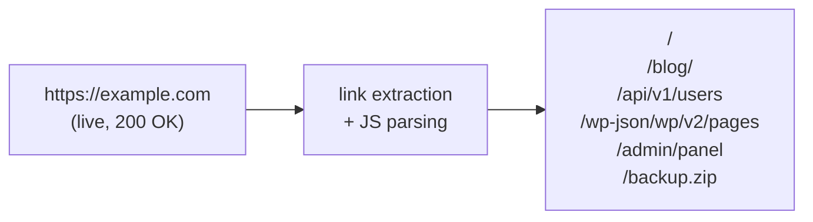

```bash
gorecon crawl https://example.com                            # basic
gorecon crawl https://example.com -d 5                       # deep crawl
gorecon crawl https://example.com -d 5 -s breadth-first      # wider coverage
gorecon crawl https://example.com -d 3 -td --json            # + tech detection
```

| Flag | Description |
|------|-------------|
| `-u`, `-list`, `--target` | Target URL(s) |
| `-d`, `--depth` | Max depth (default: 3) |
| `-s`, `--strategy` | `depth-first` or `breadth-first` |
| `-td`, `--tech-detect` | Technology detection |
| `-j`, `--json` | JSON output with full HTTP details |
| `-o`, `--output` | Output file |

---

### 7. `vuln` — Vulnerability Scanning

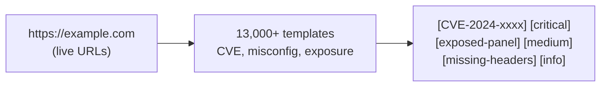

```bash
gorecon vuln -u https://example.com                          # basic
gorecon vuln -u https://example.com -s critical,high         # severity filter
gorecon vuln -u https://example.com -tags rce,xss            # tag filter
gorecon vuln -l live.txt -s critical,high -j -o findings.jsonl
```

| Flag | Description |
|------|-------------|
| `-u`, `--target` | Target URL(s) |
| `-l`, `--list` | Input file |
| `-t`, `--templates` | Templates directory (use dir, not file) |
| `-tags` | Template tags (`rce,xss,oob`) |
| `-s`, `--severity` | `info,low,medium,high,critical` |
| `-j`, `--jsonl` | JSONL output |
| `-silent` | Findings only |

---

## Workflows

### Quick Recon (~5 min)

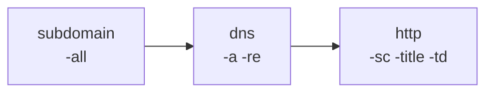

```bash
domain="example.com"
gorecon subdomain "$domain" -all -silent          > 1-subs.txt
gorecon dns -l 1-subs.txt -a -re                   > 2-dns.txt
gorecon http -l 2-dns.txt -sc -title -td -server   > 3-http.txt
```

### Standard Recon (~15 min)

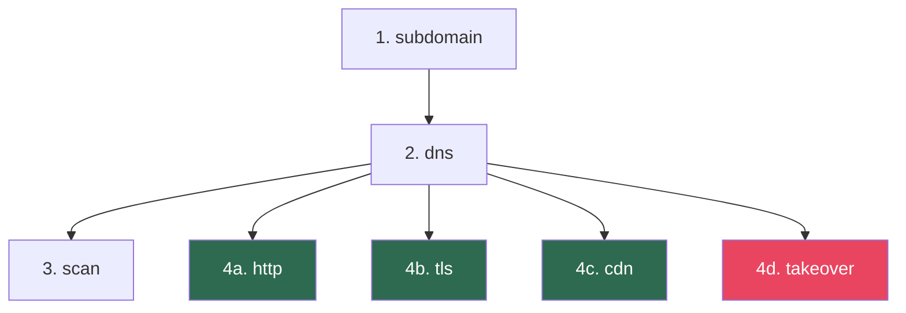

```bash
domain="example.com"
gorecon subdomain "$domain" -all -silent             > 1-subs.txt
gorecon dns -l 1-subs.txt -a -re                     > 2-dns.txt
gorecon scan -l 2-dns.txt -tp 1000 -silent           > 3-ports.txt

# Stage 4 runs in parallel
gorecon http -l 2-dns.txt -sc -title -td -server -cdn > 4-http.txt &
gorecon tls  -l 2-dns.txt -san -cn -tv                > 4-tls.txt  &
gorecon cdn  -l 2-dns.txt -resp                       > 4-cdn.txt  &
gorecon takeover -l 2-dns.txt                          > 4-takeover.txt &
wait
```

### Deep Recon (~30+ min)

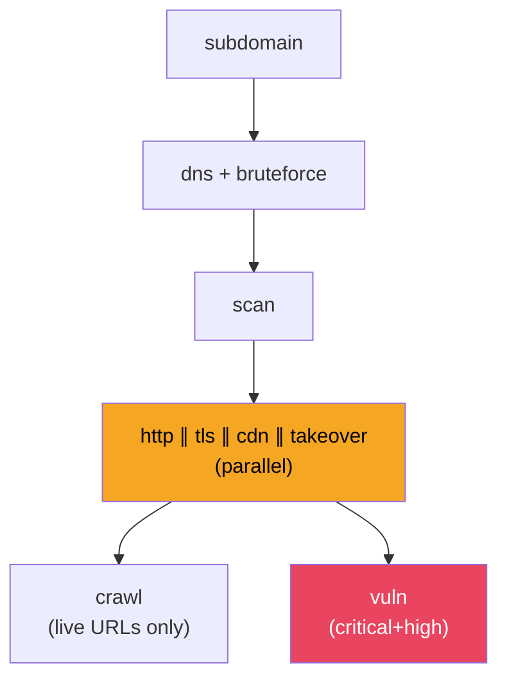

```bash
domain="example.com"

# Discovery
gorecon subdomain "$domain" -all -silent                          > 1-subs.txt
echo "$domain" >> 1-subs.txt    # always add apex
gorecon dns -d "$domain" -w /path/to/subdomains.txt -a -re        > 2-dns.txt
gorecon scan -l 2-dns.txt -tp 1000 -rate 5000 -silent            > 3-ports.txt

# Clean hostnames for HTTP/TLS/CDN
awk -F' \\[' '{print $1}' 2-dns.txt | sort -u > hosts-clean.txt

# Parallel enumeration
gorecon http -l hosts-clean.txt -sc -title -td -server -ip -cdn   > 4-http.txt &
gorecon tls  -l hosts-clean.txt -san -cn -tv -cipher -jarm        > 4-tls.txt  &
gorecon cdn  -l hosts-clean.txt -resp                              > 4-cdn.txt  &
gorecon takeover -l hosts-clean.txt                                 > 4-takeover.txt &
wait

# Crawl live endpoints
grep -E '\[20[0-9]\]|\[30[0-9]\]' 4-http.txt | awk '{print $1}' | head -10 | while read url; do
    gorecon crawl "$url" -d 3 -s breadth-first | tee -a 5-crawl.txt
done

# Vulnerability scan
gorecon vuln -l 4-http.txt -s critical,high -j -o 6-vulns.jsonl
```

### Single Command (equivalent to Deep Recon)

```bash
gorecon recon example.com

# With custom options
gorecon recon example.com \
    -o "recon-$(date +%Y%m%d)" \
    -p 80,443,8080,8443,9090 \
    -s critical,high \
    -t ~/nuclei-templates/
```

---

## Quick Reference Card

```
╔══════════════════════════════════════════════════════════════╗
║                    GORECON CHEAT SHEET                       ║
╠══════════════════════════════════════════════════════════════╣
║                                                              ║
║  DISCOVER WHAT EXISTS:                                       ║
║    gorecon subdomain <domain> -all -silent -o subs.txt       ║
║    gorecon dns -l subs.txt -a -re          -o dns.txt        ║
║    gorecon scan -l dns.txt -tp 1000        -o ports.txt      ║
║                                                              ║
║  FIND WHAT'S ALIVE:                                          ║
║    gorecon http -l dns.txt -sc -title -td  -o live.txt       ║
║    gorecon tls  -l dns.txt -san -cn -tv    -o tls.txt        ║
║    gorecon cdn  -l dns.txt -resp           -o cdn.txt        ║
║    gorecon takeover -l dns.txt             -o takeover.txt   ║
║                                                              ║
║  SEARCH ENGINES (external discovery):                         ║
║    gorecon uncover -d <domain>                                ║
║    gorecon uncover -q "ssl:target" -a shodan -l 100           ║
║                                                              ║
║  DIG DEEPER:                                                 ║
║    gorecon crawl <live-url> -d 3 -s breadth-first            ║
║    gorecon vuln  -l live.txt -s critical,high -j             ║
║                                                              ║
║  ONE COMMAND DOES IT ALL:                                    ║
║    gorecon recon <domain>                                    ║
║                                                              ║
║  PIPING:                                                     ║
║    gorecon subdomain ... | gorecon dns -a -ro | gorecon http ║
║                                                              ║
║  CORRECT ORDER:                                              ║
║    subdomain → dns → scan → (http∥tls∥cdn∥takeover) → crawl→vuln ║
║                                                              ║
╚══════════════════════════════════════════════════════════════╝
```

---

## Tips & Tricks from Real Bug Hunting

### 1. TLS is your best friend for infrastructure mapping

TLS certificates often reveal more than any other stage. A single cert can expose related domains, brands, and internal hostnames via SAN fields.

```bash
# Always include these TLS flags
gorecon tls -l hosts.txt -san -cn -so -tv -cipher -jarm

# Real example: a *.sheingsp.com cert exposed 30+ SHEIN brand domains
# in the SAN field — shein.com, romwe.com, sheglam.com, shopemeryrose.com...
```

### 2. CDN ≠ single tenant

Akamai `edgekey.net` and CloudFront `cloudfront.net` CNAMEs mean the IP is shared across many customers. Don't assume one IP = one target.

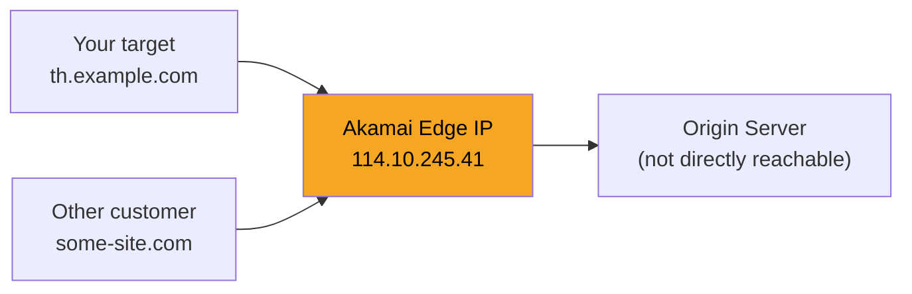

```bash
# Always check who owns the IP
gorecon cdn -l ips.txt -resp
# If behind CDN, you're probing shared infrastructure
```

### 3. Takeover: CNAMEs pointing to SaaS = check them

Subdomain takeover is one of the highest-signal findings in bug bounty. A dangling CNAME to an unclaimed Heroku/AWS/GitHub Pages app means anyone can register it and serve content on your target's subdomain.

```bash
# Auto-discovery + check in one command
gorecon takeover -d example.com -all

# Dry-run first to see what CNAMEs exist
gorecon takeover -d example.com -v --no-http

# Then verify with HTTP
gorecon takeover -d example.com -o findings.txt

# Common false positive: CloudFront. Exclude it.
gorecon takeover -d example.com --exclude cloudfront
```

### 4. Clean hostnames between DNS and HTTP/TLS/CDN

DNS `-re` output includes IPs and record types. HTTP/TLS need clean hostnames.

```bash
# ❌ WRONG — HTTP gets confused by [A] [IP] format
gorecon dns -l subs.txt -a -re -o dns.txt
gorecon http -l dns.txt

# ✅ RIGHT — extract hostnames first
gorecon dns -l subs.txt -a -re -o dns.txt
awk -F' \\[' '{print $1}' dns.txt | sort -u > hosts-clean.txt
gorecon http -l hosts-clean.txt
```

### 5. SPA pages need headless crawl

Single Page Applications render content via JavaScript. Standard crawl only parses static HTML.

**SPA Detection Checklist:**
- Page title is generic (`GSP`, `App`, `Loading...`)
- Body is short or contains `<div id="root">` / `<div id="app">`
- Standard crawl returns only the root URL (no links discovered)

> **Workaround:** Use the `-hl` (headless) flag for JS-rendered pages: `gorecon crawl https://target.com -hl -d 3`

### 6. Nuclei needs patience and template scoping

With 13,000+ templates, nuclei SDK init takes 30-90 seconds.

```bash
# ✅ Start narrow, expand if needed
gorecon vuln -u https://target.com -s critical -silent
gorecon vuln -u https://target.com -t ~/nuclei-templates/http/misconfiguration/
gorecon vuln -u https://target.com -tags cve -s critical,high

# ✅ Use directories (not single files) for -t
gorecon vuln -u https://target.com -t ~/nuclei-templates/http/   # ✅
gorecon vuln -u https://target.com -t ~/nuclei-templates/http/specific.yaml  # ❌

# ❌ Avoid: no severity filter + no template scope = very slow
gorecon vuln -l live.txt    # scans ALL 13k templates
```

### 7. Country TLD subdomains = global CDN

If you find `cn.`, `us.`, `br.`, `th.` subdomains all serving the same app:

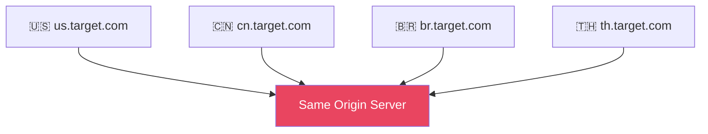

- Test one country endpoint = test all (same origin)
- Check if content differs by region (pricing, availability, language)

### 8. Always add the apex domain

Subdomain enumeration often misses `example.com` itself.

```bash
gorecon subdomain -d example.com -silent > subs.txt
echo "example.com" >> subs.txt   # ← always add this
gorecon dns -l subs.txt -a -re
```

### 9. Flag styles

All flags support both single-dash and double-dash forms:

```bash
gorecon tls example.com -san -cn -tv       # ✓ short
gorecon tls example.com --san --cn --tv    # ✓ explicit
```

### 10. Common Gotchas

```mermaid
flowchart TD
    Q1["FTL: no input list provided?"] --> A1["Missing required flag.<br/>Use -d (subdomain), -host (scan),<br/>-i (cdn), -u (crawl)"]
    Q2["Subdomain shows 0 results?"] --> A2["Target has no passive DNS.<br/>Try -all flag or add apex manually."]
    Q3["HTTP returns 0 results?"] --> A3["DNS output format mismatch.<br/>Extract clean hostnames from DNS -re output."]
    Q4["Crawl returns only 1 URL?"] --> A4["Page is SPA or redirect.<br/>Standard crawler can't execute JS."]
    Q5["Vuln times out?"] --> A5["Too many templates loaded.<br/>Add -s critical or -t <specific-dir>."]
    Q6["No templates available?"] --> A6["Wrong template path.<br/>Use a directory, not a single file."]
    Q7["Takeover shows nothing?"] --> A7["CNAME may point to claimed service.<br/>Use -v to see all CNAME records."]

    style Q1 fill:#3d0000,color:#e94560
    style Q2 fill:#3d0000,color:#e94560
    style Q3 fill:#3d0000,color:#e94560
    style Q4 fill:#3d0000,color:#e94560
    style Q5 fill:#3d0000,color:#e94560
    style Q6 fill:#3d0000,color:#e94560
    style Q7 fill:#3d0000,color:#e94560
    style A1 fill:#002d00,color:#4ecdc4
    style A2 fill:#002d00,color:#4ecdc4
    style A3 fill:#002d00,color:#4ecdc4
    style A4 fill:#002d00,color:#4ecdc4
    style A5 fill:#002d00,color:#4ecdc4
    style A6 fill:#002d00,color:#4ecdc4
    style A7 fill:#002d00,color:#4ecdc4
```

---

## Utility Commands

```bash
gorecon tools            # list all integrated engines
gorecon list             # alias for 'tools'
gorecon version          # show version (v1.0.0)
gorecon help             # show usage overview
gorecon help <command>   # show detailed help for a command
gorecon update           # show rebuild instructions
```

---

## Build

```bash
make build        # go build with stripped symbols
make install      # install to ~/.local/bin
make all          # fmt + vet + build
make clean        # remove binary + cache
```

## Requirements

- **Go 1.26+**
- Local ProjectDiscovery repos (see `go.mod` replace directives)
- Nuclei templates in `~/nuclei-templates/` (for `vuln`)

## License

MIT
